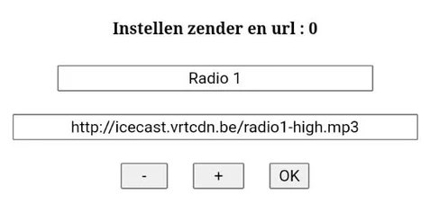

# ESP32 Webradio – Gebruikershandleiding

## Inhoud
- [Overzicht](#overzicht)
- [Benodigdheden](#benodigdheden)
- [Eerste start](#eerste-start)
- [Webinterface](#webinterface)
  - [Home](#home)
  - [EQ & Volume](#eq--volume)
  - [Zenders bewerken](#zenders-bewerken)
  - [Netwerkinstellingen](#netwerkinstellingen)
  - [MP3-lijst maken](#mp3-lijst-maken)
- [Voorbeeld `zender_data.csv`](#voorbeeld-zender_datacsv)
- [Veelvoorkomende problemen](#veelvoorkomende-problemen)

## Overzicht
ESP32 Webradio speelt internetradio en lokaal opgeslagen mp3's af. Je bedient alles via een eenvoudige webinterface op het IP-adres van de ESP32.  
Deze build is getest met **ESP32-A1S AudioKit (ES8388)**.

## Benodigdheden
- ESP32 AudioKit (ES8388)
- MicroSD-kaart (met `zender_data.csv` en optioneel mappen `mp3_0`, `mp3_1`, …)
- Voedingsadapter/USB
- WiFi-netwerk

## Eerste start
1. Plaats de microSD-kaart met `zender_data.csv` in de ESP32.
2. Start de ESP32 op.
3. Verbind met je router **of** met het AP `ESP32webradio` (wachtwoord: `ESP32pswd`).  
4. Open in je browser: `http://<IP-adres>` van de ESP32.

## Webinterface

### Home


- Bovenin zie je de huidige zender en (indien beschikbaar) de songtitel.
- Met **- / + / OK** kies je een zender uit je lijst.

### EQ & Volume


- **L / M / H**: Equalizerwaarden (-40 t/m +6 dB).
- **V**: Volume (0 t/m 21).
- Bevestig met **OK** om instellingen op te slaan.

### Zenders bewerken


- Selecteer een **index** met **- / +** bij *Instellen zender en url*.
- Vul **zendernaam** en **url** in en druk op **OK**.
- De lijst wordt naar `zender_data.csv` teruggeschreven.

### Netwerkinstellingen


- In **AP-modus** kun je **SSID**, **PSWD** en gewenst **IP-adres** instellen.
- Na bevestigen herstart de ESP32.

### MP3-lijst maken


- Kies **mp3 lijst maken** in het selectieveld.
- Het systeem doorzoekt mappen `mp3_0`, `mp3_1`, … en maakt songlijsten (`/songlijstX`).
- Na afloop kun je via **mp3 speler** willekeurig afspelen.

## Voorbeeld `zender_data.csv`

> **Let op:** Dit bestand **heeft geen header**. Elke regel is:  
> `zendernaam,stream-url`.

Een klein voorbeeld (in de root van de SD-kaart als `/zender_data.csv`):

```
NPO Radio 1,http://icecast.omroep.nl/radio1-bb-mp3
Radio Joe Nederland,http://example.com/joe-nl-stream.mp3
Studio Brussel,http://icecast.vrtcdn.be/stubru-high.mp3
BBC Radio 6 Music,http://stream.live.vc.bbcmedia.co.uk/bbc_6music
KEXP,http://kexp-mp3-128.streamguys1.com/kexp128.mp3
```

> **Vervang** de URL van *Radio Joe Nederland* met de echte stream-URL die werkt voor jouw regio. Zorg dat de URL met `http` of `https` begint.

## Veelvoorkomende problemen

- **Geen zenders in de lijst zichtbaar**  
  Controleer of elke URL in `zender_data.csv` met `http` begint _(het systeem filtert hierop)_.

- **Webinterface laadt niet**  
  Controleer het IP-adres in de seriële monitor of verbind met het AP `ESP32webradio`.

- **MP3-speler start niet**  
  Controleer of `/totaal` en `/songlijstX`-bestanden/mappen zijn aangemaakt. Zo niet, laat opnieuw **mp3 lijst maken** lopen.

---
